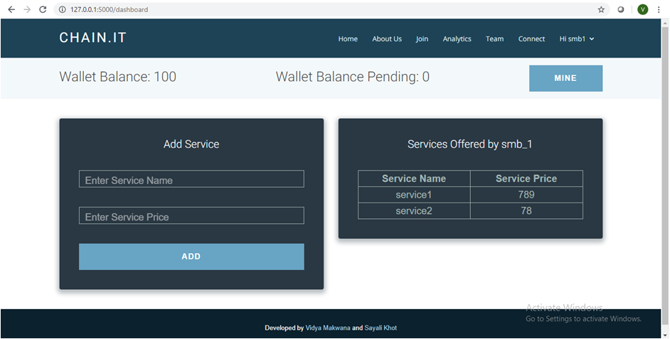
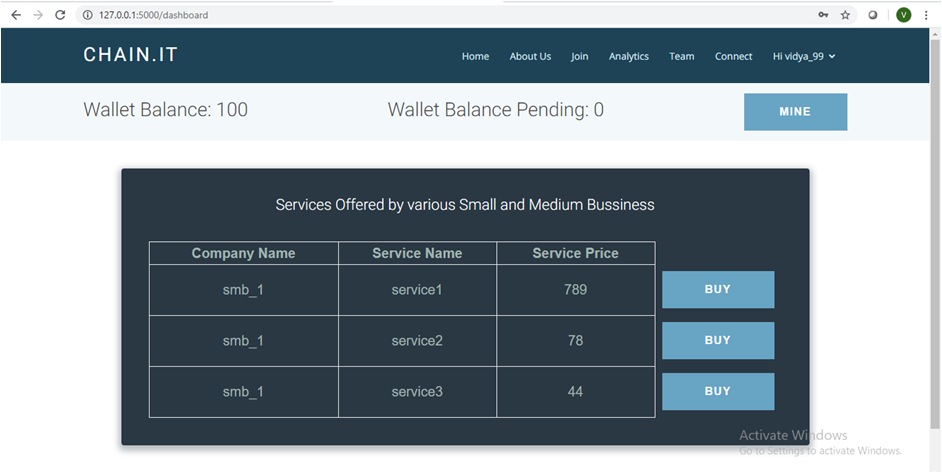
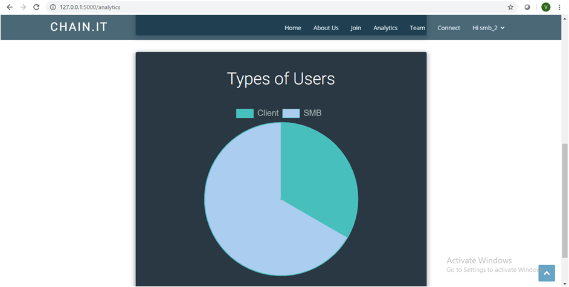
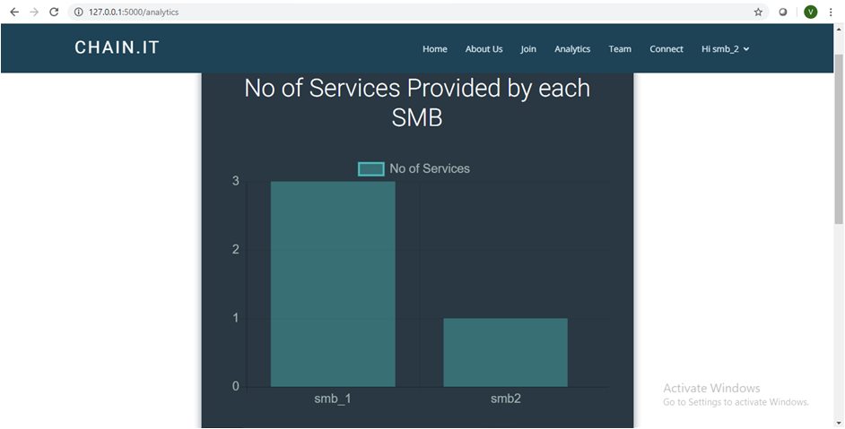

<h1 align="center">CHAIN.IT</h1>

Small and Medium business contribute to over 80% of the total payments transactions and financial industry is committed to help these businesses to nurture and support local economies at scale. However, there are many difficulties involved in their end to end processes. This makes it important to leverage use of technology available to help them come together and flourish.

### Goals of this project:

* [x] To create a complete decentralised network with no data dominance.
* [x] To secure transactions and minimize frauds.
* [x] To automate the inventory and supply chain management through Smart Contracts.
* [x] To highlight useful insights by real time data anaysis.

### Demo:

### Future scope of this project:

* [ ] Location can be recorded for every transaction to trace the frauds if any.
* [ ] Offline working of the nodes.
* [ ] Provide Notary services.

#### The project can be run by following the steps below:
* Clone this [repo](https://github.com/vidyam99/chain.it):
	* `git clone https://github.com/vidyam99/chain.it.git`
* Navigate to the folder:
  * `cd chain.it/WebApp`
* Install the requirements:
  * `pip install -r requirements.txt`
* Run the Flask WebApp. Create multiple instances of the server by varying the port number:
  * `flask run --port 5000`
  * `flask run --port 5001`
* Enter the localhost url into web browser:
  * `http://127.0.0.1:5000`
  * `http://127.0.0.1:5001`

<h3 align="center"><b>Developed by <a href="https://github.com/vidyam99">Vidya Makwana</a> and <a href="https://github.com/sayali-khot">Sayali Khot</a> with Blockchain, Flask and :heart:.</b></h1>
